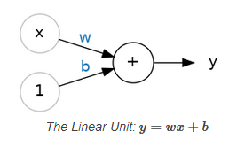

Welcome to Machine Learning!
This module will be an introduction to machine learning algorithms.
The goal of this module is to introduce these algorithms and how you can use them for real world problems.

Machine learning is a subset of artificial intelligence (AI) that allows systems to learn and improve from experience without being explicitly programmed.
Instead of following hard-coded rules, machine learning models analyze large amounts of data to identify patterns, make predictions, or take actions based on those patterns.

Two types of machine learning algorithms are supervised learning and unsupervised learning.
Supervised learning is where the model is trained on labeled data, meaning each input is paired with a corresponding output.
The model learns to map inputs to outputs by minimizing the error between its predictions and the actual labels, allowing it to predict outcomes for new, unseen data.
Unsupervised learning is where the model is trained on unlabeled data, with no explicit output provided.
The model identifies hidden patterns or structures in the data, such as clusters or associations, without predefined categories or labels.

Some of the machine learning algorithms that will be covered in this module include:
- Linear regression
- Logistic regression
- Decision tree
- Random forest

